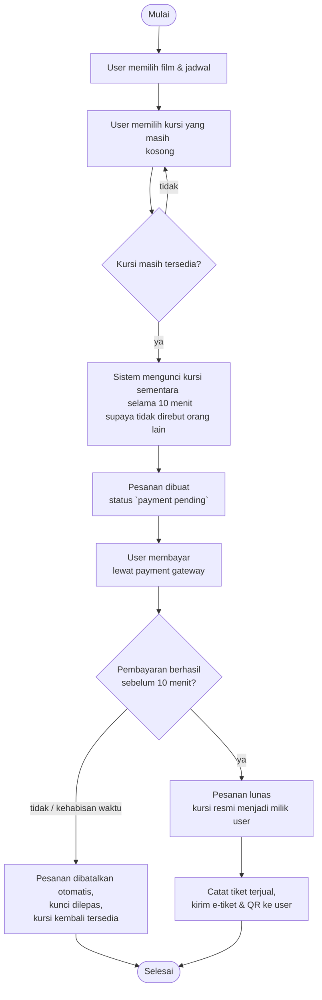
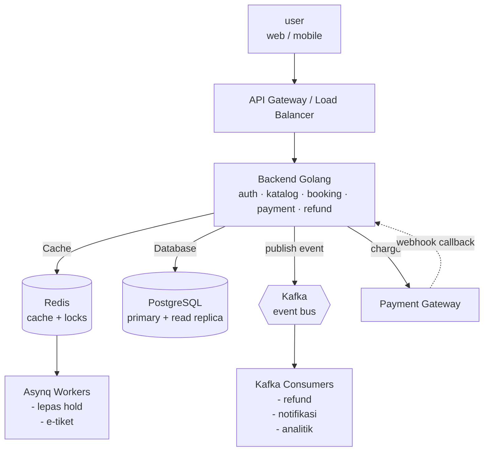
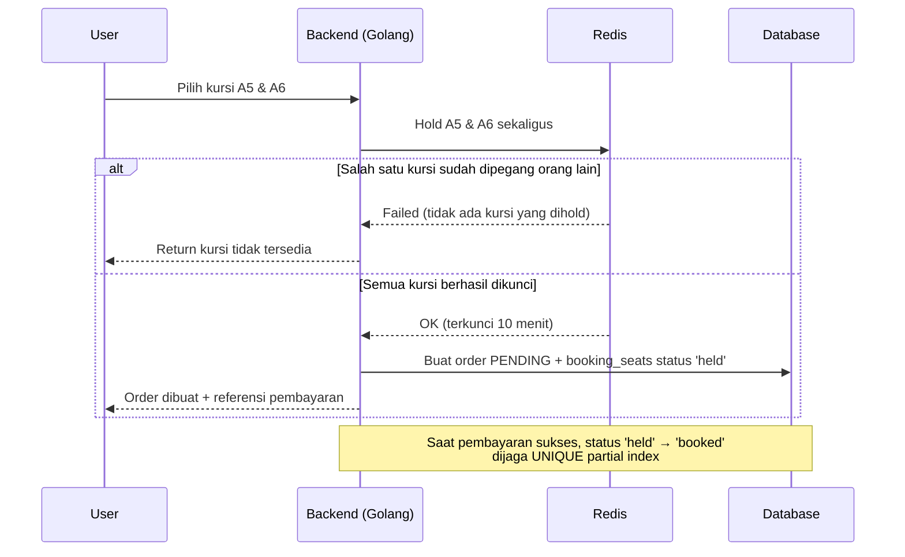

# System Design — Platform Pembelian Tiket Bioskop Online

---

## Ringkasan teknologi

| Komponen | Teknologi | Peran |
|---|---|---|
| Backend | **Golang** | API auth, katalog, jadwal, booking, payment, refund |
| Database | **PostgreSQL** | Data transaksional |
| Cache | **Redis** | "Hold" kursi sementara (atomik, auto-expire) + cache peta kursi |
| Queue | **Asynq** (redis) | Job queue & bisa di-retry, kirim e-tiket |
| Event bus | **Kafka** | Fakta durable & bisa di-replay: `ticket.sold`, `schedule.cancelled`, `refund.requested`, `seat.restocked` |
| Payment Gateway | mock | Charge + webhook callback; idempotent |

---

## Tugas 1 — Flowchart sistem general




Gambaran komponen sistem secara besar (siapa bicara dengan siapa):



---

## Tugas 2 — Penjelasan solusi

### A. Pemilihan tempat duduk — cepat untuk banyak orang, tapi mustahil rebutan

Tantangannya: ribuan orang bisa melihat & memilih kursi pada saat bersamaan (mis. tiket promo), tetapi satu kursi tidak boleh terjual ke dua orang.



**Redis Lock**

Saat user klik kursi, backend mengunci tiap kursi secara atomik di redis. Kalau salah satu kursi gagal dikunci, tidak ada satu pun yang dikunci. Operasi in-memory ini sanggup puluhan ribu permintaan/detik, jadi database tidak kebanjiran traffic.

**Database Transaction**

Saat pembayaran sukses, status kursi di-`booked` di dalam 1 transaksi, dijamin oleh unique partial index.
Walau Redis sempat error / ada race yang lolos, database tetap menolak kursi dobel. 

---

### B. Restok tiket bioskop yang sudah terjual

Stok kursi tidak disimpan sebagai angka counter , melainkan dihitung dari formula:

```py
available_seats = total_seats - held_seats - booked_seats
```

Kursi kembali ke pool lewat dua jalur tanpa pernah menghapus histori (hanya mengubah status):

(1) hold kedaluwarsa — bila order belum dibayar dalam 10 menit, key Redis hangus sendiri (TTL) dan job Asynq `booking.release_hold` menandai order `expired` serta mengubah kursi `held` → `released`;

(2) pembatalan/refund - `booking_seats.status` diubah `booked` → `released`. Begitu berstatus `released`, unique partial index melepas kursi tersebut sehingga bisa dipesan ulang, dan setiap restok mem-publish event `seat.restocked` ke Kafka agar cache peta kursi dibersihkan dan update bisa dikirim ke klien.

---

### C. Refund / pembatalan dari pihak bioskop

Saat bioskop membatalkan 1 jadwal tayang (film batal, studio rusak), ratusan order harus di-refund sekaligus — di sinilah Kafka berperan karena event-nya harus durable, urut, dan bisa di-retry/replay.

(1) Admin set status jadwal menjadi `cancelled`, lalu sistem mem-publish event `schedule.cancelled`

(2) consumer mencari semua order LUNAS pada jadwal itu dan, untuk tiap order, membuat refund `PENDING` sambil mem-publish `refund.requested` (satu pesan per order, sehingga bila satu gagal yang lain tetap jalan dan yang gagal masuk antrian retry/DLQ).

(3) Refund Processor lalu memanggil payment gateway memakai `idempotency_key` (mencegah dobel-refund) jika sukses, order menjadi `REFUNDED`, kursi `booked` → `released` (otomatis ter-restok), kemudian event `seat.restocked` dan notifikasi pengembalian dana dikirim ke pelanggan. User juga bisa melakukan refund mandiri (`initiated_by = 'customer'`, endpoint `POST /api/bookings/{id}/refund`) lewat pipeline yang sama.

## API Contract

### Skema

```json
// Success with data
{
  "data": { ... }
}
```
```json
// Success with pagination
{
  "data": {
    "<plural>": [...],
    "total_page": n,
    "total_data": n
  }
}
```
```json
// Success without data
{
  "message": "..."
}
```
```json
// error
{
  "error": "..."
}
```

---

### 1. Auth

| Method | Path | Auth | Keterangan |
|---|---|---|---|
| `POST` | `/api/auth/register` | publik | Daftar user baru (role default `user`) |
| `POST` | `/api/auth/login` | publik | Login, dapatkan token |
| `POST` | `/api/auth/refresh-token` | publik | Tukar refresh token jadi access token baru |

**POST `/api/auth/register`**
```json
// request
{ "email": "user@mail.com", "password": "secret12", "full_name": "Budi" }
// 201
{ "message": "User registered successfully" }
```
Validasi: `email` (format email, wajib), `password` (min 8, wajib), `full_name` (opsional).

**POST `/api/auth/login`**
```json
// request
{ "email": "admin@cinema.test", "password": "admin123" }
// 200
{ "data": { "access_token": "eyJhbGci...", "refresh_token": "eyJhbGci..." } }
// 400
{ "error": "invalid email or password" }
```

**POST `/api/auth/refresh-token`**
```json
// request
{ "refresh_token": "eyJhbGci..." }
// 200
{ "data": { "access_token": "eyJhbGci...", "refresh_token": "eyJhbGci..." } }
```

---

### 2. Movies (katalog film)

| Method | Path | Auth | Keterangan |
|---|---|---|---|
| `GET` | `/api/movies` | user | List film (pagination + filter `title`) |
| `POST` | `/api/movies` | admin | Buat film |
| `GET` | `/api/movies/{id}` | user | Detail film |
| `PATCH` | `/api/movies/{id}` | admin | Update sebagian field |
| `DELETE` | `/api/movies/{id}` | admin | Hapus film (`409` bila masih dipakai jadwal) |

**Body create** (`PATCH` = semua opsional):

| Field | Tipe | Wajib | Catatan |
|---|---|---|---|
| `title` | string | ya | |
| `duration_min` | int | ya | > 0 |
| `description` | string | tidak | |
| `genre` | string | tidak | |
| `rating` | string | tidak | mis. `PG-13` |
| `poster_url` | string | tidak | |
| `active` | bool | tidak | hanya pada `PATCH` |

```json
// POST /api/movies — 201
{ "data": {
  "id": "uuid", "title": "Inception", "duration_min": 148,
  "genre": "Sci-Fi", "rating": "PG-13", "active": true,
  "created_at": "2026-06-19T19:00:00+07:00", "modified_at": "...",
  "created_by": "uuid", "modified_by": "uuid"
} }
```

---

### 3. Cinemas (cabang bioskop)

| Method | Path | Auth | Keterangan |
|---|---|---|---|
| `GET` | `/api/cinemas` | user | List (filter `name`, `city`) |
| `POST` | `/api/cinemas` | admin | Buat cinema |
| `GET` | `/api/cinemas/{id}` | user | Detail |
| `PATCH` | `/api/cinemas/{id}` | admin | Update |
| `DELETE` | `/api/cinemas/{id}` | admin | Hapus (`409` bila masih punya studio) |

| Field | Tipe | Wajib |
|---|---|---|
| `name` | string | ya |
| `city` | string | ya |
| `address` | string | tidak |
| `active` | bool | tidak (`PATCH`) |

```json
// POST /api/cinemas — 201
{ "data": { "id": "uuid", "name": "CGV Grand Indonesia", "city": "Jakarta", "address": "Jl. M.H. Thamrin No.1", "active": true, "created_at": "...", "modified_at": "...", "created_by": "uuid", "modified_by": "uuid" } }
```

---

### 4. Studios (auditorium) — auto-generate kursi

| Method | Path | Auth | Keterangan |
|---|---|---|---|
| `GET` | `/api/studios` | user | List (filter `name`) |
| `POST` | `/api/studios` | admin | Buat studio + **otomatis generate kursi** (transaksional) |
| `GET` | `/api/studios/{id}` | user | Detail |
| `PATCH` | `/api/studios/{id}` | admin | Update `name`/`active` |
| `DELETE` | `/api/studios/{id}` | admin | Hapus (kursi ikut terhapus / cascade) |

**Body create:**

| Field | Tipe | Wajib | Catatan |
|---|---|---|---|
| `cinema_id` | string (uuid) | ya | `400` bila cinema tidak ada |
| `name` | string | ya | unik per cinema (`409` bila dobel) |
| `row_count` | int | ya | 1–26 (baris A, B, C, …) |
| `cols_per_row` | int | ya | 1–50 |
| `vip_rows` | int | tidak | N baris terakhir jadi VIP (default 0) |

`total_seats = row_count × cols_per_row`. Kursi otomatis dibuat dengan label `A1..`, `B1..`, dst.

```json
// POST /api/studios — 201
{ "data": { "id": "uuid", "cinema_id": "uuid", "name": "Studio 1", "total_seats": 32, "row_count": 4, "cols_per_row": 8, "active": true, "created_at": "...", "modified_at": "...", "created_by": "uuid", "modified_by": "uuid" } }
```

---

### 5. Schedules (jadwal tayang) — *deliverable utama (Test C.2)*

| Method | Path | Auth | Keterangan |
|---|---|---|---|
| `GET` | `/api/schedules` | user | List (filter `movie_id`, `studio_id`, `status`, `show_date`) |
| `POST` | `/api/schedules` | admin | Buat jadwal (`end_time` dihitung otomatis) |
| `GET` | `/api/schedules/{id}` | user | Detail |
| `PATCH` | `/api/schedules/{id}` | admin | Update `start_time`/`price`/`status` |
| `POST` | `/api/schedules/{id}/cancel` | admin | Batalkan jadwal → memicu **mass refund** |
| `DELETE` | `/api/schedules/{id}` | admin | Hapus (`409` bila sudah ada booking) |
| `GET` | `/api/schedules/{id}/seat-map` | user | Peta kursi real-time |

**Body create:**

| Field | Tipe | Wajib | Catatan |
|---|---|---|---|
| `movie_id` | string (uuid) | ya | `400` bila film tidak ada |
| `studio_id` | string (uuid) | ya | |
| `start_time` | string (RFC3339) | ya | mis. `2026-12-01T19:00:00+07:00` |
| `price` | number | ya | > 0 |

`end_time` = `start_time` + durasi film. Dua jadwal di studio yang sama **tidak boleh bentrok waktu** → `409`. `status` di-`PATCH` hanya boleh `scheduled` \| `cancelled` \| `finished`.

```json
// POST /api/schedules — 201
{ "data": {
  "id": "uuid", "movie_id": "uuid", "studio_id": "uuid",
  "show_date": "2026-12-01", "start_time": "2026-12-01T19:00:00+07:00",
  "end_time": "2026-12-01T21:28:00+07:00", "price": 50000,
  "status": "scheduled", "active": true,
  "created_at": "...", "modified_at": "...", "created_by": "uuid", "modified_by": "uuid"
} }
// 409 (overlap)
{ "error": "the studio already has a schedule overlapping this time" }
```

**GET `/api/schedules/{id}/seat-map`** → ketersediaan kursi (`available = total − held − booked`):
```json
{ "data": {
  "schedule_id": "uuid", "total_seats": 32, "available": 30, "held": 0, "booked": 2,
  "seats": [
    { "seat_id": "uuid", "seat_label": "A1", "row_label": "A", "seat_type": "regular", "status": "available" },
    { "seat_id": "uuid", "seat_label": "A2", "row_label": "A", "seat_type": "regular", "status": "booked" }
  ]
} }
```
`status` kursi: `available` \| `held` \| `booked`.

**POST `/api/schedules/{id}/cancel`** → `200 { "message": "schedule cancelled; refunds are being processed" }`.

---

### 6. Bookings (pemesanan & seat hold)

| Method | Path | Auth | Keterangan |
|---|---|---|---|
| `POST` | `/api/bookings` | user | Hold kursi + buat booking `PENDING` |
| `GET` | `/api/bookings` | user | List booking milik user (pagination) |
| `GET` | `/api/bookings/{id}` | user | Detail booking (pemilik / admin) |
| `POST` | `/api/bookings/{id}/refund` | user | Refund mandiri (pemilik) |

**POST `/api/bookings`** — mengunci kursi di Redis (all-or-nothing) lalu membuat order pending + referensi pembayaran.

| Field | Tipe | Wajib |
|---|---|---|
| `schedule_id` | string (uuid) | ya |
| `seat_ids` | array string (uuid) | ya (min 1) |

```json
// request
{ "schedule_id": "uuid", "seat_ids": ["seatUuid1", "seatUuid2"] }
// 201
{ "data": {
  "id": "uuid", "booking_code": "BK-AB12CD34EF", "user_id": "uuid", "schedule_id": "uuid",
  "status": "pending", "total_amount": 100000, "seat_count": 2,
  "expires_at": "2026-12-01T19:10:00+07:00", "payment_reference": "MOCK-XXXX",
  "seats": [ { "seat_id": "uuid", "status": "held", "price": 50000 } ],
  "created_at": "...", "modified_at": "...", "created_by": "uuid", "modified_by": "uuid"
} }
// 409 (kursi sudah dipegang/booked orang lain)
{ "error": "one or more seats are no longer available" }
```

`status` booking: `pending` → `confirmed` (setelah bayar) / `expired` (timeout) / `refunded`.

**POST `/api/bookings/{id}/refund`** (hanya booking `confirmed` milik sendiri):
```json
// request (opsional)
{ "reason": "berhalangan hadir" }
// 202
{ "message": "refund requested; it is being processed" }
// 409
{ "error": "only confirmed bookings can be refunded" }
```

---

### 7. Payments — webhook (mock gateway)

| Method | Path | Auth | Keterangan |
|---|---|---|---|
| `POST` | `/api/payments/webhook` | `X-Webhook-Secret: <secret>` | Settle pembayaran (dipicu gateway / reviewer) |

| Field | Tipe | Wajib | Catatan |
|---|---|---|---|
| `reference` | string | ya | dari `payment_reference` saat booking dibuat |
| `status` | string | ya | `success` \| `failed` |

```json
// header: X-Webhook-Secret: <secret>
// request — sukses
{ "reference": "MOCK-XXXX", "status": "success" }
// 200
{ "message": "payment confirmed, booking is now CONFIRMED" }

// request — gagal
{ "reference": "MOCK-XXXX", "status": "failed" }
// 200
{ "message": "payment failed, booking released" }

// 401 (secret salah)
{ "error": "invalid webhook secret" }
```

- `success` → booking `confirmed`, kursi `held` → `booked`, publish event `ticket.sold`.
- `failed` → booking `expired`, kursi `held` → `released`, publish `seat.restocked`.
